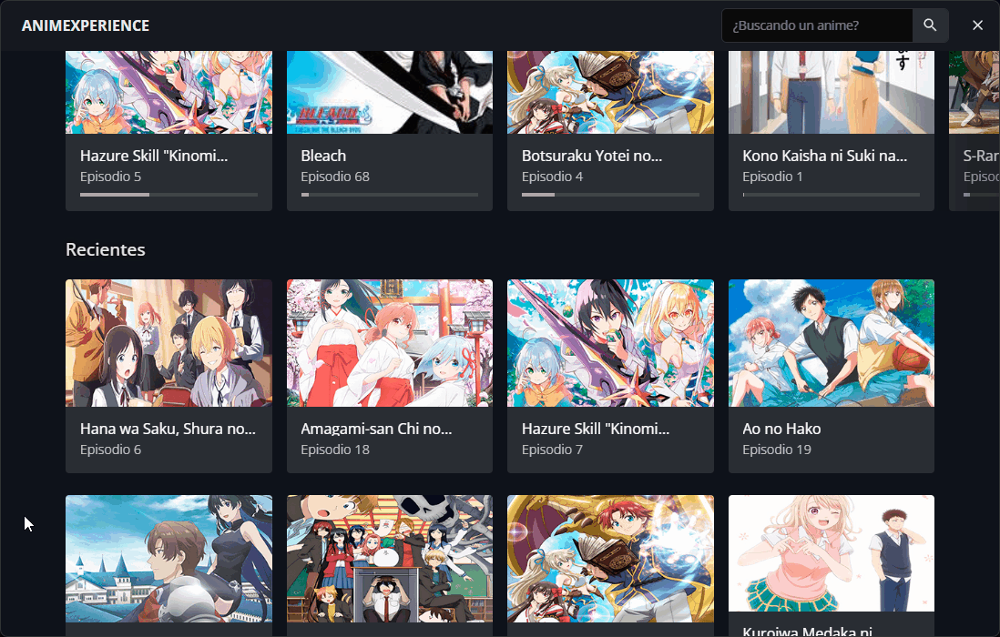
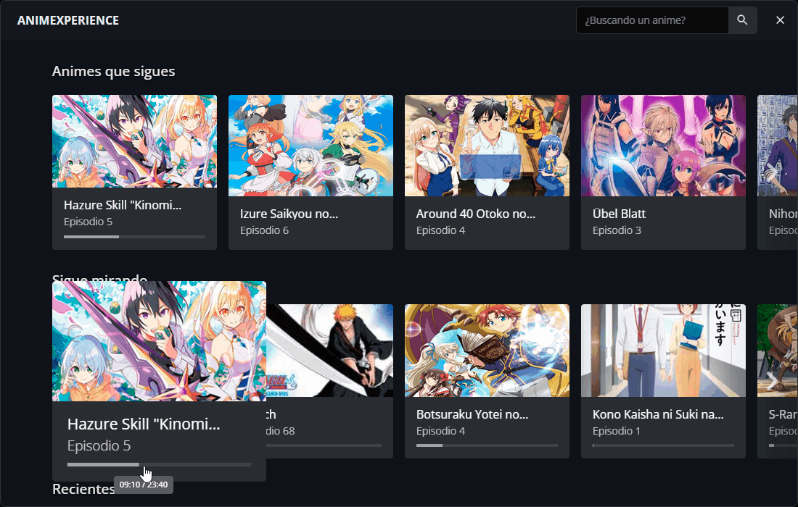
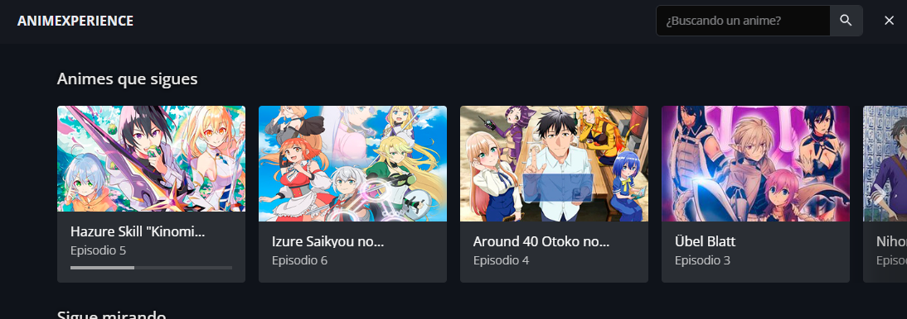

# Animexperience

Automatized high level scrapper of an anime page to provide a better user experience based on the retrieved data.

With low level interception in video players such as MEGA, OK.RU and more that makes their features controllable and overridable.

In technical aspects this is also: an Electron application with React and TypeScript

Note: This project is for personal use only and a proof of my knowledge in this area.

You can contact me in my [LinkedIn profile](https://www.linkedin.com/in/jeweells/) or emailing me at [abraham.pacheco6319@gmail.com](mailto:abraham.pacheco6319@gmail.com).

## What does Animexperience have to offer?

As the name suggests, it improves your experience while watching anime.

_Submerge in the experience of watching anime with the app simplicity._

<br/>
Animexperience lets you quickly view a summary of what you're watching, what you didn't end up watching and what has been released this week.


Watch your favorite anime by just clicking once



Autoplay the whole series, stop getting out of your bed to play the next episode


Return where you left the last time you stopped watching an episode




Every time you open the app, you will see the latest releases of your followed animes in the first row:



There's also many more features such as shortcuts, episode sharing and so on...

### [Download for Windows and MacOS](https://github.com/jeweells/animexperience/releases)

## Run this project locally

### Install

```bash
$ yarn
```

### Development

```bash
$ yarn dev
```

### Build

```bash
# For windows
$ yarn build:win

# For macOS
$ yarn build:mac

# For Linux
$ yarn build:linux
```
